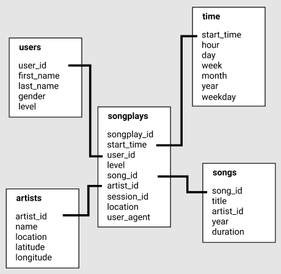

# Sparkify: Data Modeling with Postgres

Sparkify is a startup with a music streaming app. Data scientists at Sparkify are particularly interested in understanding what songs users are listening to.

The goal of this project is to define a data model that will help our data scientists answer questions about user activity. Then create an ETL pipeline that transfers data from our song and user activity logs to Postgres tables.

## File Overview
- `data/song_data/` - contains our song data in json format. files are partitioned by the first three letters of each song's track ID
- `data/log_data/` - contains our user activity logs in json format. files are partitioned by year and month
- `sql_queries.py` - states all of our SQL queries for: droping tables, creating tables, inserting rows, and a query for finding song_id, artist_id given a song name, artist name, and song duration
- `create_tables.py` - Python script that drops and then creates our tables.
- `etl.py` - Our ETL pipeline. Iterates through our song and log files and pipes the data into our database tables.
- `test.ipynb` - Runs SQL queries to check the first few values of each of our database tables.
- `etl.ipynb` - Exploratory work that can be used to look at our json files and test various etl approaches for getting data from the json files into our databases

Be sure to close all database connections and run `create_tables.py` before running `etl.py` or `etl.ipynb`. 

After Running either of those etl files, you can run `test.ipynb` to check the values of each of our database tables.

## The Data Model: Star Schema



For the sake of our Data Scientists, we've decided to use a Star Schema data model. The Star Schema is a subset of the concept of "fact and dimension tables". In our case, the Fact Table is `songplays` and our Dimension Tables are `users`, `songs`, `artists`, and `time`. 

**Why Star Schema?**

The benefits of a Star Schema is that our data is denormalized, allowing for simpler queries and quicker aggregations. This will allow our data scientists to be able to easily query our data and gain insights regarding what songs users are listening to.

It's important to note that this data model does have drawbacks. Denormalization means decreases in data integrity and query flexibility.

## Example Queries

Some notes about the data before we get to the queries. The user activity logs used in this ETL pipeline only cover a single month, November 2018. It also so happens that the songs described in our song data have zero overlap with the songs referenced in the activity logs for this month. In concrete terms, that means that the `song_id` and `artist_id` columns of our `songplays` table are empty. 

These factors limit the kinds of queries we can make on this set of data. I also chose to omit the use of some sort of time bounding on these example queries, because they are all bound to a one month timeframe to begin with.

**What's the average number of songs that Users listen to**

Query:
```sql
SELECT AVG(songplay_count) FROM (
    SELECT user_id, count(*) as songplay_count FROM songplays GROUP BY user_id
) AS avg_songplay_count
```
No joins needed for this query, we can just do a count on our `songplays` Fact Table.

Result:

|avg                 |
|--------------------|
|71.0416666666666667 |

**Who are our most active users, are they paying users?**

Query:
```sql
SELECT users.user_id, first_name, last_name, count(*) as songplay_count, users.level
FROM songplays JOIN users ON songplays.user_id=users.user_id
GROUP BY users.user_id
ORDER BY songplay_count DESC
LIMIT 10
```
In this case, we join our Dimension Table, `users`, to retrieve information about each user.

Result:

|user_id |	first_name |	last_name |	songplay_count |	level |
|--------|-------------|--------------|----------------|----------|
|49      |  Chloe      |	Cuevas    |	689            |	paid  |
|80      |	Tegan      |	Levine    |	665            |	paid  |
|97      |	Kate       |	Harrell   |	557            |	paid  |
|15      |	Lily       |	Koch      |	463            |	paid  |
|44      |	Aleena     |	Kirby     |	397            |	paid  |
|29      |	Jacqueline |	Lynch     |	346            |	paid  |
|24      |	Layla      |	Griffin   |	321            |	paid  |
|73      |	Jacob      |	Klein     |	289            |	paid  |
|88      |	Mohammad   |	Rodriguez |	270            |	free  |
|36      |	Matthew    |	Jones     |	248            |	paid  |

**What's the most active day of the week for users?**

Query:
```sql
SELECT weekday, count(*) as songplay_count
FROM songplays JOIN time ON songplays.start_time=time.start_time
GROUP BY weekday
ORDER BY songplay_count DESC
```
Here use a single join, because we require weekday information which is on our `time` Dimension Table.

Result:

|weekday   | songplay_count |
|----------|----------------|
|Wednesday | 1370           |
|Friday    | 1297           |
|Tuesday   | 1073           |
|Thursday  | 1054           |
|Monday    | 1014           |
|Saturday  | 630            |
|Sunday    | 396            |
